## Hướng dẫn cấu hình gửi cảnh báo qua SMS trên OMD

### Menu
- [1. Chuẩn bị](#1)
	- [1.1 Đăng kí SMS Gateway](#11)
	- [1.2 Chuẩn bị Script](#12)
		- [Tải Script](#121)
		- [Chỉnh sửa thông tin trong Script](#122)
		- [Copy Script vào thư mục cấu hình](#123)
- [2. Cấu hình trên Web UI của Check_MK - OMD](#2)
- [3. Kiểm tra hoạt động](#3)

 <a name="1"></a>
## 1. Chuẩn bị

 <a name="11"></a>
### 1.1 Đăng kí SMS Gateway

Trong bài hướng dẫn này, chúng tôi sử dụng một Gateway SMS có tên là [Nexmo](https://www.nexmo.com/), nó cho phép chúng ta dùng thử trước khi quyết định sử dụng.

Đăng kí sử dụng tại: https://dashboard.nexmo.com/sign-up

Sau khi đăng kí xong, chúng ta sẽ được cấp `KEY` và `SECRET` để truy cập API.


 <a name="12"></a>
### 1.2 Chuẩn bị Script

- **Bước 1**: Tải Script và phân quyền

**Lưu ý**: Script này chỉ sử dụng cho SMS Gateway là Nexmo. Nếu sử dụng một SMS Gateway khác, vui lòng thay thế câu lệnh API vào Script.

```
cd /opt
wget https://gist.githubusercontent.com/hoangdh/13b7799d12377fea6891283852e7dec9/raw/c86d2a34195b46d5f2c3ace15864a84db6393d26/omd-sms_notify -O sms_notify
chmod +x sms_notify
```

- **Bước 2**: Chỉnh sửa thông tin trong Script

Chúng ta sửa/điền thông tin vào `KEY` và `SECRET` ở bước [chuẩn bị](#11) vào trong script.


- **Bước 3**: Copy vào thư mục cấu hình

```
cd /opt
cp sms_notify /opt/omd/versions/1.2.8p21.cre/share/check_mk/notifications
```

**Chú ý:** Thay thế phiên bản OMD mà bạn đang dùng vào câu lệnh. Bài hướng dẫn sử dụng phiên bản `1.2.8p21.cre`

Để xem phiên bản đang sử dụng, vui lòng chạy lệnh sau:

```
omd version
```


Chuyển sang bước tiếp theo để cấu hình trên Web UI.

<a name="2"></a>
### 2. Cấu hình trên Web UI OMD

- **Bước 1:** Tạo một USER nhận SMS

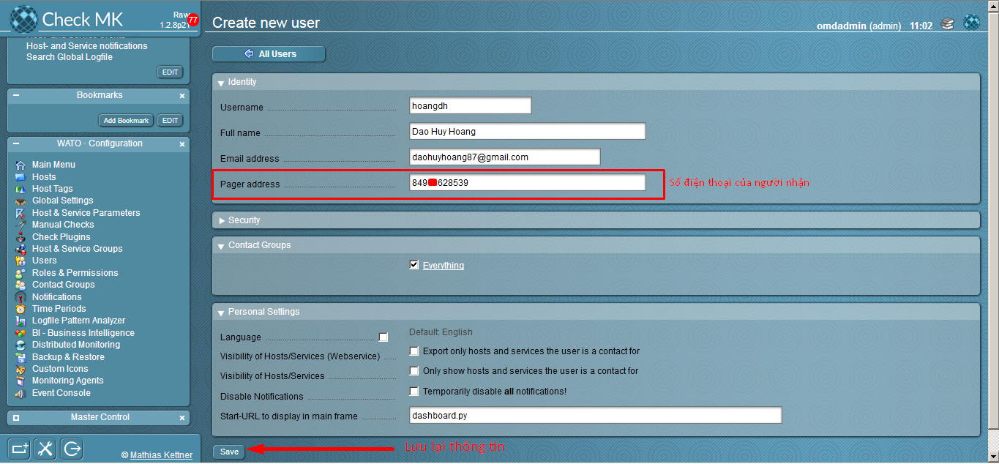

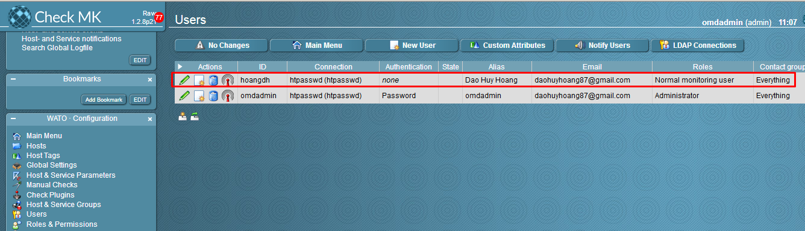

- **Bước 2:** Chúng ta vào **WATO - Configuration > Notifications > New Rule**:


- **Bước 3:** Điền thông tin và chọn **SMS Notify**

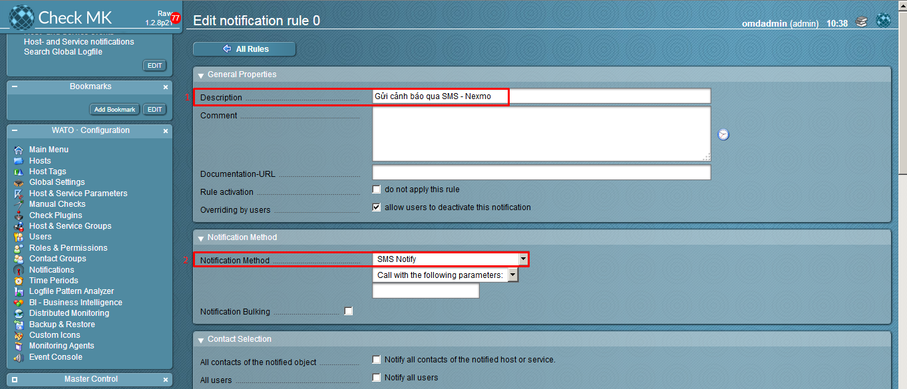

Chọn user muốn gửi SMS

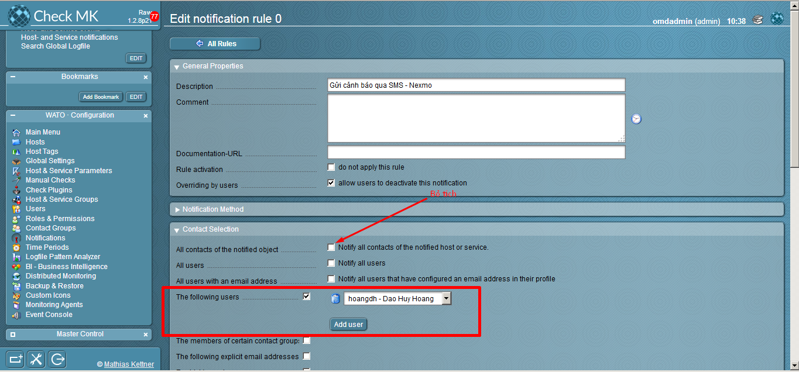

- **Bước 4:** Kéo xuống và lưu lại thông tin:


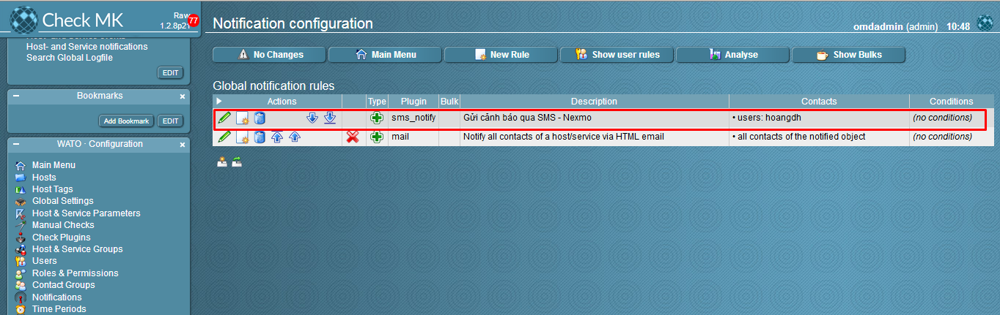

 <a name="3"></a>
### 3. Kiểm tra hoạt động

Chúng ta vào một dịch vụ bất kỳ và thử cảnh báo.

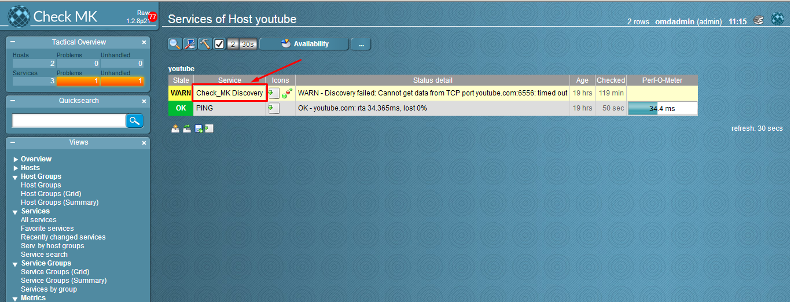

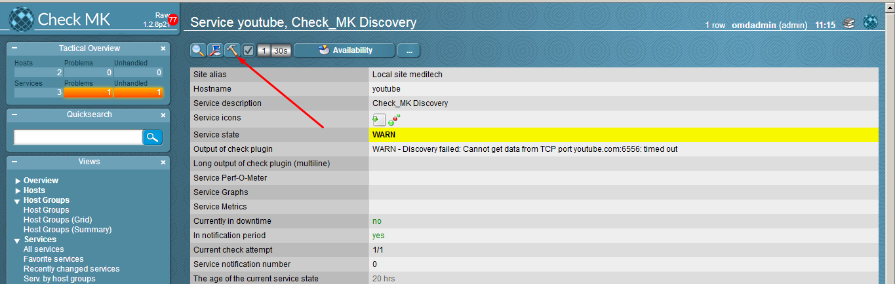

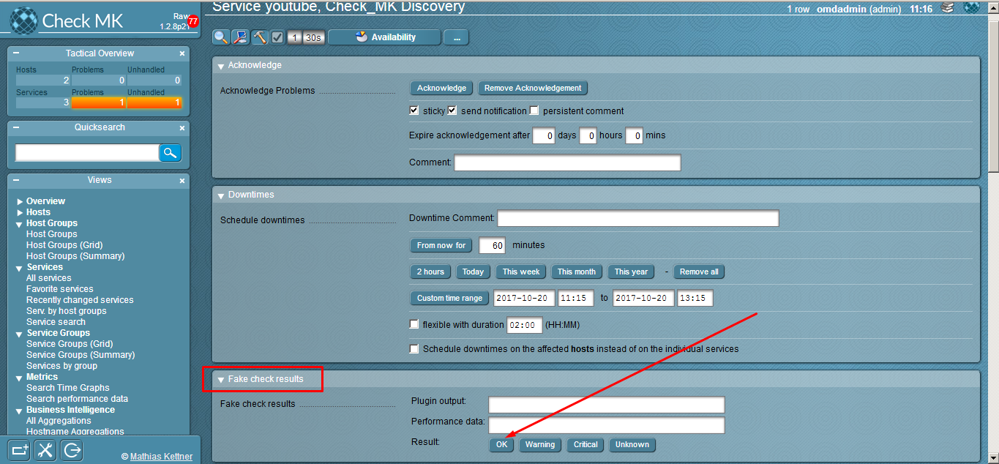

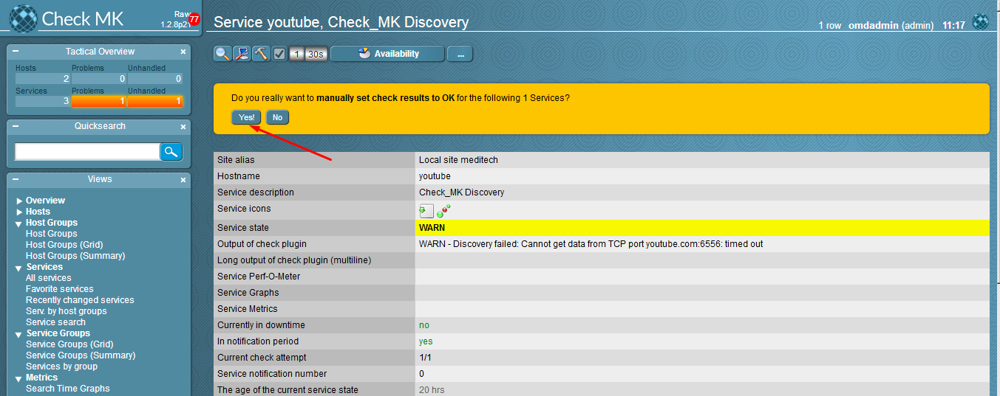

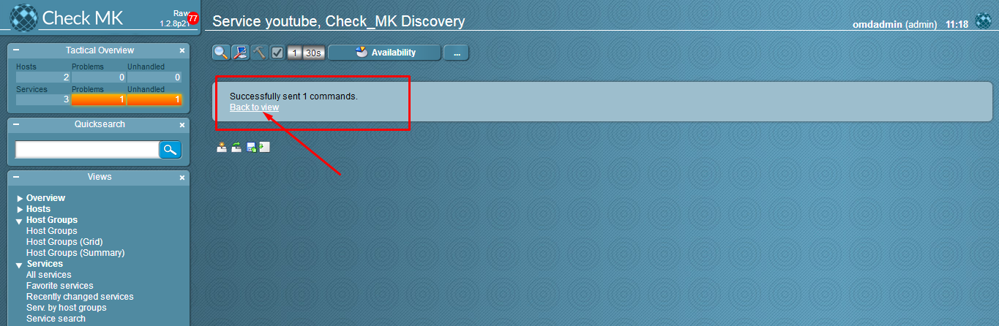

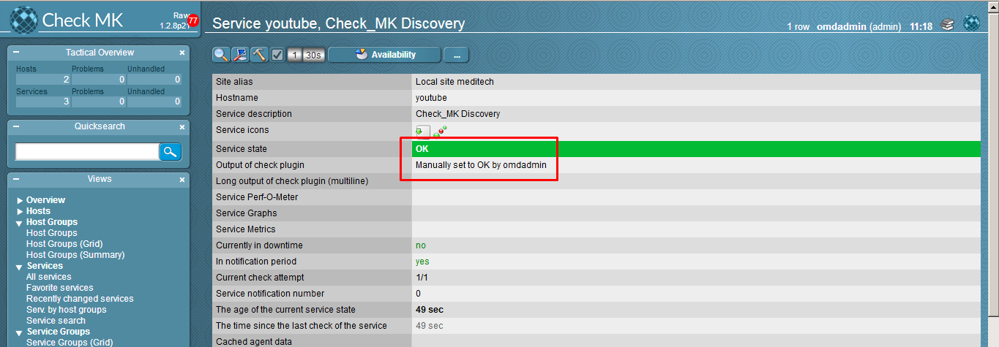

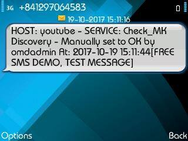

**Chúc các bạn thành công!**
